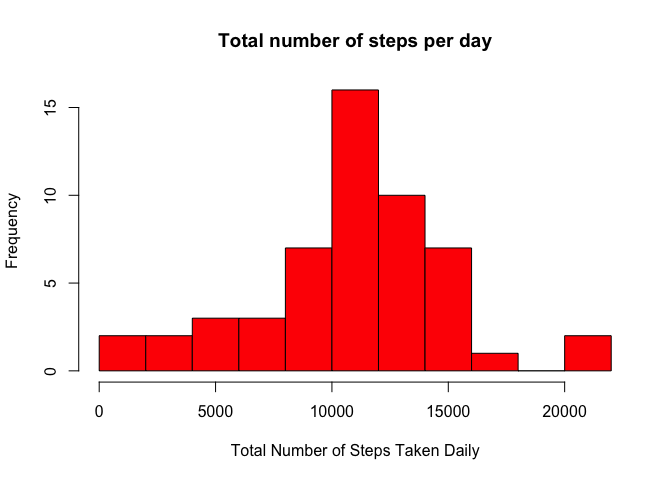

# Reproducible Research: Peer Assessment 1

# Reproducible Research Peer Assignment 1

## Introduction

It is now possible to collect a large amount of data about personal movement using activity monitoring devices such as a Fitbit, Nike Fuelband, or Jawbone Up. These type of devices are part of the “quantified self” movement – a group of enthusiasts who take measurements about themselves regularly to improve their health, to find patterns in their behavior, or because they are tech geeks. But these data remain under-utilized both because the raw data are hard to obtain and there is a lack of statistical methods and software for processing and interpreting the data.

This assignment makes use of data from a personal activity monitoring device. This device collects data at 5 minute intervals through out the day. The data consists of two months of data from an anonymous individual collected during the months of October and November, 2012 and include the number of steps taken in 5 minute intervals each day.

## Data

The data for this assignment can be downloaded from the course web site:

Dataset: Activity monitoring data [52K]

The variables included in this dataset are:

steps: Number of steps taking in a 5-minute interval (missing values are coded as NA)

date: The date on which the measurement was taken in YYYY-MM-DD format

interval: Identifier for the 5-minute interval in which measurement was taken

The dataset is stored in a comma-separated-value (CSV) file and there are a total of 17,568 observations in this dataset.

## Loading and preprocessing the data

First we need to read the CSV file into a data frame using read.csv() function, and converting the date column. There should be 17,568 observations in this dataset.


```r
data <- read.csv(unz('activity.zip','activity.csv'), stringsAsFactors=F)
data$date <- as.Date(data$date)
str(data)
```

```
## 'data.frame':	17568 obs. of  3 variables:
##  $ steps   : int  NA NA NA NA NA NA NA NA NA NA ...
##  $ date    : Date, format: "2012-10-01" "2012-10-01" ...
##  $ interval: int  0 5 10 15 20 25 30 35 40 45 ...
```

## What is mean total number of steps taken per day?

For this part of the assignment, you can ignore the missing values in the dataset. Make a histogram of the total number of steps taken each day. Calculate and report the mean and median total number of steps taken per day


```r
data.nona<- na.omit(data) 
daily.steps <- rowsum(data.nona$steps, format(data.nona$date, '%Y-%m-%d')) 
daily.steps <- data.frame(daily.steps) 
names(daily.steps) <- ("steps") 

hist(daily.steps$steps, 
     main="Total number of steps per day",
     breaks=10, col='red',
     xlab="Total Number of Steps Taken Daily", ylab = "Frequency")
```

 

** Mean and median number of steps taken each day **


```r
options(scipen = 1, digits = 2)
mean_steps<-mean(daily.steps$steps, na.rm = TRUE)
cat('Mean is', mean_steps, '\n')
```

```
## Mean is 10766
```

```r
median_steps<-median(daily.steps$steps, na.rm = TRUE)
cat('Median is', median_steps, '\n')
```

```
## Median is 10765
```

The mean is 10766.19 and median is 10765.

## What is the average daily activity pattern?

1. Make a time series plot (i.e. type = "l") of the 5-minute interval (x-axis) and the average number of steps taken, averaged across all days (y-axis)


```r
library(dplyr)
```

```
## 
## Attaching package: 'dplyr'
## 
## The following object is masked from 'package:stats':
## 
##     filter
## 
## The following objects are masked from 'package:base':
## 
##     intersect, setdiff, setequal, union
```

```r
byinterval <- group_by(data, interval=as.factor(interval))
o <- summarise(byinterval,
    avg_steps = mean(steps, na.rm=TRUE))
plot(levels(o$interval), o$avg_steps, 
     type="l", col="blue", lwd=3, 
     main="Daily activity pattern", 
     xlab="Interval", ylab="Average number of steps")
```

 

2. Which 5-minute interval, on average across all the days in the dataset, contains the maximum number of steps?


```r
m<-which.max(o$avg_steps)
```

Interval 835 contains the maximum number of steps. On average across all the days 206.17 steps are taken. 

## Imputing missing values

Note that there are a number of days/intervals where there are missing values (coded as NA). The presence of missing days may introduce bias into some calculations or summaries of the data.

*Calculate and report the total number of missing values in the dataset (i.e. the total number of rows with NAs)*

```r
# The following command report the total number of missing values in the data set in each column
colSums(is.na(data))
```

```
##    steps     date interval 
##     2304        0        0
```

As you can see only 'steps" columns contains NA values. The total number of missing values in the dataset is 2304.

*Devise a strategy for filling in all of the missing values in the dataset. The strategy does not need to be sophisticated. For example, you could use the mean/median for that day, or the mean for that 5-minute interval, etc.*

Our strategy is to search for missing values in 'steps' column and fill in the missing values with the mean for that 5-minute interval.

*Create a new dataset that is equal to the original dataset but with the missing data filled in.*

A new data set *newdata* is created that is equal to the original data frame with missing values filled in.


```r
zz <- rep(NA, length(data$steps))
for (i in 1:length(data$steps)) {
    if (is.na(data[i,1] == TRUE)) {
        p<-which(levels(o$interval)==as.factor(data[i,3]))
        zz[i] <- as.numeric(o[p, 2])
    } else {
        zz[i] <- data[i,1]
    }
}
newdata <- as.data.frame(zz)
newdata$date <- data$date
newdata$interval <- data$interval
names(newdata) <- names(data)
head(newdata)
```

```
##   steps       date interval
## 1 1.717 2012-10-01        0
## 2 0.340 2012-10-01        5
## 3 0.132 2012-10-01       10
## 4 0.151 2012-10-01       15
## 5 0.075 2012-10-01       20
## 6 2.094 2012-10-01       25
```

Make a histogram of the total number of steps taken each day and Calculate and report the mean and median total number of steps taken per day. Do these values differ from the estimates from the first part of the assignment? What is the impact of imputing missing data on the estimates of the total daily number of steps?


```r
daily.steps.new <- rowsum(newdata$steps, format(newdata$date, '%Y-%m-%d')) 
daily.steps.new <- data.frame(daily.steps.new) 
names(daily.steps.new) <- ("steps") 

hist(daily.steps.new$steps, 
     main="Total number of steps per day",
     breaks=10, col='blue',
     xlab="Total Number of Steps Taken Daily", ylab = "Frequency")
```

 

*Report the mean and median*


```r
options(scipen = 1, digits = 2)
mean_steps.new<-mean(daily.steps.new$steps, na.rm = TRUE)
cat('Mean is', mean_steps, '\n')
```

```
## Mean is 10766
```

```r
median_steps.new<-median(daily.steps.new$steps, na.rm = TRUE)
cat('Median is', median_steps.new, '\n')
```

```
## Median is 10766
```

The mean is 10766.19 and median is 10766.19. The mean remains the same and the median is slight different.

## Are there differences in activity patterns between weekdays and weekends?

For this part the weekdays() function may be of some help here. Use the dataset with the filled-in missing values for this part.

Create a new factor variable in the dataset with two levels – “weekday” and “weekend” indicating whether a given date is a weekday or weekend day.

Make a panel plot containing a time series plot (i.e. type = “l”) of the 5-minute interval (x-axis) and the average number of steps taken, averaged across all weekday days or weekend days (y-axis). See the README file in the GitHub repository to see an example of what this plot should look like using simulated data.


```r
newdata['type_of_day'] <- weekdays(as.Date(newdata$date))
newdata$type_of_day[newdata$type_of_day  %in% c('Saturday','Sunday') ] <- "weekend"
newdata$type_of_day[newdata$type_of_day != "weekend"] <- "weekday"

newdata$type_of_day <- as.factor(newdata$type_of_day)

# calculate average steps by interval across all days
df_imputed_steps_by_interval <- aggregate(steps ~ interval + type_of_day, newdata, mean)

library("lattice")
p <- xyplot(steps ~ interval | factor(type_of_day), data=df_imputed_steps_by_interval, type = 'l',
       main="Average Number of Steps Taken \nAveraged Across All Weekday or Weekend",
       xlab="5-Minute Interval",
       ylab="Average Number of Steps Taken")
print (p)  
```

 

The panel plots indicates that people moves more during weekends.
